### React Server Components(RSC)

- React Server Components is a new architecture that was introduced by the React team and quickly adopted by Next.js

- This architecture a new approach to creating React component by dividing them into two distinct types

1. Server components
2. Client components

## React Server Components contd

- Server components are the default in Next.js — you get them without doing anything. They're great for data-heavy rendering (database queries, file reads) because they run entirely on the server before the HTML is sent to the browser. The trade-off is they can't be interactive.
- By default, Next.js treats all components as Server components
- These components can perform server-side tasks like reading files or fetching data directly from a database
- The trade-off that they can't use React hooks or handle user interactions

## Client Components

- Client components opt in with "use client" at the top of the file. They run in the browser, so they support hooks and event handlers — but they lose access to server-side resources.
- To create a Client component, you'll need to add the "use client" directive at the top of your component file
- While Client components can't perform server-side tasks like reading files, they can use hooks and handle user interactions
  
