## Routing

Next.js has a file system based routing system. The URLs you can access in your browser are determined by how you organize your files and folders in your code.

### Routing Conventions

- All routes must live inside the `app` folder
- Route files must be named either `page.js` or `page.tsx`
- Each folder represents a segment of the URL path

### Example

```
app/
├── page.tsx         →  /
├── about/
│   └── page.tsx     →  /about
└── profile/
    └── page.tsx     →  /profile
```

> **Key rule:** A folder alone does not create a route — it must contain a `page.tsx` (or `page.js`) file to be accessible in the browser.

# 🚀 Next.js Nested Routing (App Router)

## 📌 Introduction

Nested routing in Next.js allows you to create routes using the folder structure inside the `app/` directory.

Each folder represents a route, and each `page.tsx` file defines the UI for that route.

---

## 📂 Folder Structure Example

```
app/
│
├── blog/
│   ├── page.tsx          → /blog
│   │
│   ├── first/
│   │   └── page.tsx      → /blog/first
│   │
│   └── second/
│       └── page.tsx      → /blog/second
```

---

## 🌐 Routes Mapping

| Folder Path                | URL Route      |
| -------------------------- | -------------- |
| `app/blog/page.tsx`        | `/blog`        |
| `app/blog/first/page.tsx`  | `/blog/first`  |
| `app/blog/second/page.tsx` | `/blog/second` |

---

## 🧩 Code Examples

### 1️⃣ `/blog` Page

📄 `app/blog/page.tsx`

```tsx
export default function BlogPage() {
  return (
    <div>
      <h1>Blog Home</h1>
      <p>Welcome to the blog page</p>
    </div>
  );
}
```

---

### 2️⃣ `/blog/first` Page

📄 `app/blog/first/page.tsx`

```tsx
export default function FirstBlog() {
  return (
    <div>
      <h1>First Blog</h1>
      <p>This is the first blog post</p>
    </div>
  );
}
```

---

### 3️⃣ `/blog/second` Page

📄 `app/blog/second/page.tsx`

```tsx
export default function SecondBlog() {
  return (
    <div>
      <h1>Second Blog</h1>
      <p>This is the second blog post</p>
    </div>
  );
}
```

---

## 🔗 Navigation (Optional)

You can navigate between pages using `Link`:

```tsx
import Link from "next/link";

export default function BlogPage() {
  return (
    <div>
      <h1>Blog Home</h1>

      <Link href="/blog/first">Go to First Blog</Link>
      <br />

      <Link href="/blog/second">Go to Second Blog</Link>
    </div>
  );
}
```

## ⚡ Summary

- `/blog` → Main blog page
- `/blog/first` → First blog page
- `/blog/second` → Second blog page
- Routing is automatic based on folder structure

# 🚀 Next.js Dynamic Routing (App Router)

## 📌 Introduction

Dynamic routing in Next.js allows you to create routes based on dynamic values like IDs, slugs, or usernames.

Instead of hardcoding routes, you can use **dynamic segments** using square brackets `[]`.

---

## 📂 Folder Structure Example

```bash
app/
├── products/
│   ├── page.tsx                → /products
│   └── [productId]/
│       └── page.tsx            → /products/1, /products/abc
```

---

## 🌐 Route Mapping

| Folder Path                         | URL Example     |
| ----------------------------------- | --------------- |
| `app/products/page.tsx`             | `/products`     |
| `app/products/[productId]/page.tsx` | `/products/1`   |
|                                     | `/products/abc` |

---

## 🧩 Code Implementation

### 1️⃣ Products Page

📄 `app/products/page.tsx`

```tsx
export default function Products() {
  return <h1>Products Page</h1>;
}
```

---

### 2️⃣ Dynamic Product Details Page

📄 `app/products/[productId]/page.tsx`

```tsx
export default function ProductDetails({
  params,
}: {
  params: { productId: string };
}) {
  return <h1>Product Details page {params.productId}</h1>;
}
```

👉 In Next.js, `params` is **already available synchronously**

---

## ✅ Async Version (Correct Way)

```tsx
export default async function ProductDetails({
  params,
}: {
  params: { productId: string };
}) {
  const { productId } = params;

  return <h1>Product Details page {productId}</h1>;
}
```

---

## 🔗 Navigation Example

```tsx
import Link from "next/link";

export default function Products() {
  return (
    <div>
      <h1>Products Page</h1>

      <Link href="/products/1">Product 1</Link>
      <br />

      <Link href="/products/2">Product 2</Link>
    </div>
  );
}
```

---

## ⚡ Summary

- `/products` → Products list page
- `/products/1` → Product details page for ID = 1
- `/products/abc` → Product details page for ID = "abc"

---

## ✅ Best Practices

- Use meaningful dynamic names like `[productId]`, `[slug]`
- Keep logic simple inside page components
- Fetch data using `productId`
- Use async functions only when needed

---

# Nested Dynamic Routes in Next.js

## What Are Dynamic Routes?

Dynamic routes use square bracket folders like `[id]` to capture URL parameters at runtime. When you **nest** them, each segment adds a layer to both the URL and the folder structure.

---

## Folder Structure

```
app/
└── products/
    └── [productId]/
        ├── page.tsx           ← renders /products/42
        └── review/
            └── [reviewId]/
                └── page.tsx   ← renders /products/42/review/7
```

---

## URL Pattern

| URL                     | What renders                             |
| ----------------------- | ---------------------------------------- |
| `/products/42`          | `[productId]/page.tsx`                   |
| `/products/42/review/7` | `[productId]/review/[reviewId]/page.tsx` |

---

## The Page Files

### `app/products/[productId]/page.tsx`

```tsx
type Props = {
  params: { productId: string };
};

export default function ProductPage({ params }: Props) {
  return <h1>Product: {params.productId}</h1>;
}
```

### `app/products/[productId]/review/[reviewId]/page.tsx`

```tsx
type Props = {
  params: {
    productId: string;
    reviewId: string;
  };
};

export default function ReviewPage({ params }: Props) {
  return (
    <div>
      <h1>Product: {params.productId}</h1>
      <h2>Review: {params.reviewId}</h2>
    </div>
  );
}
```

---

## Key Rules

- **Folder name = URL segment** — `products/` becomes `/products` in the URL.
- **`[param]` captures anything** — whatever the user types in that URL position is passed as `params.param`.
- **Both params are available** in the deeply nested page — `params.productId` and `params.reviewId` are both accessible inside `[reviewId]/page.tsx`.
- **`page.tsx` is what renders** — a folder without a `page.tsx` is not a route, just a layout container.

---

# Catch-all Segments in Next.js

## Two syntaxes

| Syntax        | Folder name        | Matches `/docs`?  | Matches `/docs/a/b`? |
| ------------- | ------------------ | ----------------- | -------------------- |
| `[...slug]`   | required catch-all | no — 404          | yes → `['a', 'b']`   |
| `[[...slug]]` | optional catch-all | yes → `undefined` | yes → `['a', 'b']`   |

---

## Folder structure

```
app/
└── docs/
    └── [[...slug]]/
        └── page.tsx
```

The double bracket `[[...slug]]` makes the segment **optional** — `/docs` itself also hits this page with `slug === undefined`.

---

## The page

```tsx
export default async function Docs({
  params,
}: {
  params: Promise<{ slug: string[] }>;
}) {
  const { slug } = await params;

  if (slug?.length === 2) {
    return (
      <h1>
        viewing docs for feature {slug[0]} and concept {slug[1]}
      </h1>
    );
  } else if (slug?.length === 1) {
    return <h1>viewing docs for feature {slug[0]}</h1>;
  }

  return <h1>Docs from Home</h1>;
}
```

---

## URL → params mapping

| URL                     | `slug` value             | What renders                                         |
| ----------------------- | ------------------------ | ---------------------------------------------------- |
| `/docs`                 | `undefined`              | Docs from Home                                       |
| `/docs/routing`         | `['routing']`            | viewing docs for feature routing                     |
| `/docs/routing/dynamic` | `['routing', 'dynamic']` | viewing docs for feature routing and concept dynamic |
| `/docs/a/b/c`           | `['a', 'b', 'c']`        | Docs from Home (falls to else, length > 2)           |

---

## Key rules

- `params` is a **Promise** in Next.js 15+ — always `await` it.
- `slug` is `string[]`, not a single string.
- Use optional chaining `slug?.length` because `slug` can be `undefined` when using `[[...slug]]`.
- Segments are in order: `slug[0]` is the first path segment after `/docs`, `slug[1]` is the second, etc.

---



# `notFound()` in Next.js

## What is it?

When your page **can't find data**, you call `notFound()` — it stops rendering and shows your `not-found.tsx` file.

---

## Simple Example: User Profile Page

### `app/users/[id]/page.tsx`

```tsx
import { notFound } from "next/navigation";

export default function UserPage({ params }: { params: { id: string } }) {
  const user = getUserById(params.id); // returns null if not found

  if (!user) notFound(); // stops here and shows not-found.tsx

  return <h1>Hello, {user.name}</h1>;
}
```

### `app/users/[id]/not-found.tsx`

```tsx
export default function NotFound() {
  return <h1>User not found!</h1>;
}
```

---

## What Happens?

| URL          | User Exists? | Result                    |
| ------------ | ------------ | ------------------------- |
| `/users/123` | ✅ Yes       | Shows `"Hello, John"`     |
| `/users/999` | ❌ No        | Shows `"User not found!"` |

---

## Key Takeaway

> `notFound()` is just a way to say **"I can't find this data, show the not-found page instead."**
